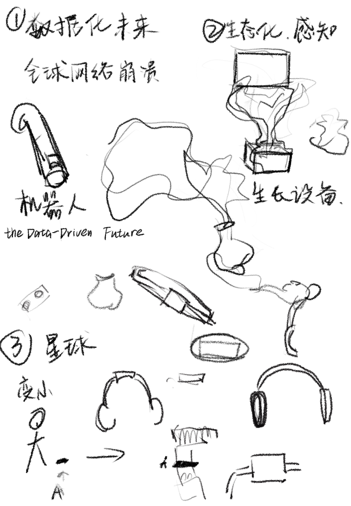
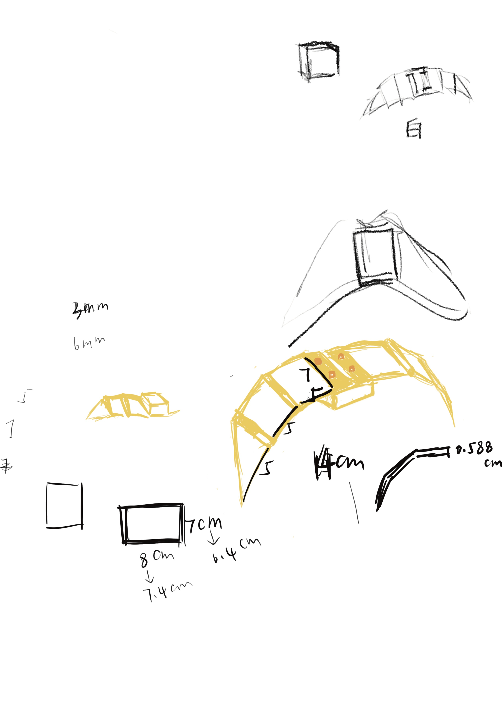

# an-Arduino-enclosure-using-a-combination-of-3D-printing-and-laser-cutting
## 1 Worldview Discussion and Construction
At the beginning, we worked in small groups to discuss and brainstorm possible worldviews. This step was essential, as it determines the rationality and consistency of the subsequent packaging design. We came up with several worldviews and further developed each one individually. The following sketches show part of our discussion process:

最开始我们以一个小组为单位，对于世界观的设定进行讨论、进行头脑风暴。这个步骤是不可缺少的，因为这决定着后续设计包装的合理性。我们想出了几个世界观，并对它进行各自的深化。以下是我们在讨论过程中的草图：

I chose the setting of a “War and Data-Driven Future.”

Here’s how I expanded on this concept:

Around the year 2200, the world has fallen into a prolonged energy crisis due to the depletion of natural resources. Traditional national borders have become blurred, and human society has reorganized into several “nation bodies,” which gradually evolved into multiple “federations.” Conflicts frequently erupt between these federations over the allocation and control of resources, sometimes escalating into full-scale wars.

With the extreme advancement of technology, the nature of warfare has changed dramatically. Replacing traditional cold and hot wars, “digital-biological warfare” has become the mainstream. This new form of war uses data as weapons and biology and the environment as battlefields—by means of environmental data monitoring, chemical substance release, and algorithmic control, it enables precise manipulation of ecosystems and populations.

In such an era, the main focus of conflict is no longer territory, but “the control of resource circulation.” Rare minerals, clean water sources, and artificial ecological zones have become core assets contested by federations. To balance interests, they often sign temporary “data treaties,” using digital methods to share resources or exert informational pressure. Social contracts have evolved accordingly, emphasizing “information transparency” and “resource traceability.” Every individual may become a node in this data-driven war.

我选择了“战争、数据化未来”这个设定。于是我对于这个设定进行扩展：

约在公元2200年，全球因资源枯竭而陷入持续的能源危机。传统的国家边界逐渐模糊，人类社会重组为若干“国家体”，继而演化为多个“联邦体”。这些联邦之间因资源分配与控制频繁爆发冲突，甚至演变为全面战争。

由于科技的高度发展，战争形态已与过去截然不同。取代传统的冷战与热战，“数字生物战争”成为主流。这种战争以数据为武器，以生物与环境为战场——通过环境数据监控、化学物质释放与算法控制，实现对生态与人群的精准干预。

在这样的时代，冲突的焦点不再是领土，而是“资源流通的控制权”。稀有矿物、洁净水源、人工生态区等，皆成为各联邦争夺的核心资产。为了平衡利益，它们常签署临时“数据协议”，以数字化手段共享资源或施加信息压力。社会契约也随之演变，强调“信息透明”与“资源可追溯”，每一个人都可能成为数据战争的节点。

## 2 Packaging Design Process
Next, I began thinking about what kind of devices might exist in this world, and what new functionalities Arduino could take on.

I came up with a wing-shaped shell design.

Functions:

1.Identity Marker in a Future Society – It represents humanity’s ability to maintain autonomy and control within a chaotic resource network.

2.Detection and Exploration – Controlled by Arduino, the wings can fly to detect chemical substances in the air and scout for potential dangers.

3.Resource Management – Serves as a micro resource guardian node that monitors water, air, and energy resources.

接着我开始思考，在这个世界观下，我们需要什么设备，arduino的新功能。

我想出了一种机翼造型的外壳。

功能：

1：未来社会中的“身份标识”：它代表了人类在混乱资源网络中维持自我生存与控制权的能力。

2：侦测、探测：arduino控制机翼飞行，可进行空气中化学物质的探测，以及对于其他潜在危险的侦查。

3：资源管理：微型资源节点守护器，监测水、空气、能源等资源。

## 3 Making Process
I began designing the outer packaging, which is divided into two parts: a 3D-printed wing and a laser-cut wooden box.

我开始着手设计这个外包装。这个外包装被分为两个部分——3D打印的机翼和激光切割的木板盒子。

### 3.1 3D Printing
I used Blender for modeling. The wing consists of three panels and two rotating shafts. The shaft design was inspired by a tutorial video with a similar structure, while the rest of the model was entirely original. Because I was not very familiar with the modeling software, I encountered quite a few challenges during the process.

Important note: When modeling in Blender, it’s crucial to pay attention to scale and unit settings. STL files only store the coordinate values of points without specifying whether the numbers represent meters, centimeters, or millimeters. As a result, in Blender, 1.0 might be interpreted as 1 meter, while in other software (such as Cura or Fusion 360), the same 1.0 would be interpreted as 1 millimeter—leading to a size difference of up to 1000 times when importing the model. I consulted ChatGPT about this issue and received useful guidance.

After completing the model, I proceeded to 3D print it at the school’s workshop using an Ultimaker printer with PLA material. The printing process took more than ten hours. Because the bottom surface area was quite large, the model adhered tightly to the build plate, making it somewhat difficult to remove.

我使用blender进行建模，机翼由三个板块和两个转轴构成，转轴参考了一个类似结构的教学视频，其他部分完全是原创。因为对于建模软件的不熟悉，在建模过程中遇到了不少挑战。

注意点：使用blender建模需要注意尺寸问题，因为STL 文件只存储“点的坐标值”，但没有说明这些数字代表米、厘米还是毫米。所以在 Blender 中 1.0 可能代表 1 米，而在其他软件中（如 Cura 或 Fusion 360），同样的 1.0 会被理解成 1 毫米，导致模型导入时尺寸相差 1000 倍。对于这个问题，我询问了ChatGPT，它给出了以下的答案：

建模完成后需要对其进行3D打印。我在学校的工坊进行打印，使用了ultimaker打印机，材质是pla。打印一共花费十几个小时。因为与底面接触面积较大，在取下模型时，有些粘连，比较难取。

### 3.2 Laser Cutting
I used the MakerCase website to generate the box’s shape. The line width and kerf compensation settings were crucial. After some testing, we found suitable parameters for cutting 3mm-thick wooden boards in the school workshop, ensuring the pieces fit together tightly and securely.

I then used Adobe Illustrator (AI) to refine the drawings, leaving openings for the Arduino’s USB port and round jack.

Problems encountered:

Initially, I entered the board thickness as 3mm on the website, but upon measurement, the actual thickness was 2.65mm, which caused fitting issues in the joints. After correcting the dimensions and re-cutting, the parts fit perfectly.
After cutting, I painted the wooden pieces with acrylic paint.

我使用了MakerCase网站制作盒子外形，切割线宽度和切割补偿设置非常重要。在经过我们的尝试，在学校工坊并使用3mm厚的木板进行切割时，以下这组数据是较为合适的，切出来的木板可以很紧、很牢固地组合在一起。

接着我使用adobe的ai对于图纸进行加工，留出了arduino的USB口和圆形插孔的位置。

在激光切割过程中出现的一些问题：一开始我在网站上输入的木板厚度是3mm，但实际测量出来的结果是2.65mm，这就导致了在嵌合部分的尺寸发生了错误。后来我在网站上重新输入了尺寸，重新激光切割。这次的尺寸是合适的。

激光切割后我又对木板进行丙烯颜料的上色。

## 4 Assembly
During assembly, I found that the holes in my 3D-printed model were slightly too small (3.9mm), which made it difficult to fit the 3mm heat-set inserts properly, while the 2.5mm ones were too loose. Fortunately, using a soldering iron allowed me to install the inserts successfully. I originally installed five of them, but after my teacher’s advice, I realized only two were necessary since the structure’s load-bearing capacity was already sufficient.

After consulting the teacher, I learned the correct way to combine the 3D-printed parts with the laser-cut wood: drill holes in the wood that exactly match the screw size (equal to the insert diameter). I used a punch to make the holes in the wooden board. In hindsight, if I had designed the holes during the laser-cutting stage, I could have skipped this step—but I had forgotten, so manual drilling was necessary.

Finally, I selected appropriate screws for the heat-set inserts and used a screwdriver to attach the wood and 3D-printed parts together.

在组装过程中，因为我对于3D打印的模型留孔略小（3.9mm），导致3mm的热熔螺母没办法很好地匹配，而2.5mm的又使孔显得略大。好在使用了电烙铁，能将热熔螺母安装进去。我安装了五个螺母，但在老师的提醒下，我意识到其实根本不需要装这么多，仅需两个就足够了，因为其承重足够大。

在询问老师后，知道了该如何把3D打印和激光切割组合到一起——应该给木板打洞，并且洞要正好契合螺丝钉大小，即螺母直径。于是我使用了打孔机对切割好的木板进行打孔。其实如果在切割时直接切出孔，就可以省略这一步骤，但因为我忘记了，所以只能进行打孔。

接着，我挑选了适合热熔螺母的螺丝，并使用螺丝刀将木板与3D打印出的物体固定在一起。

## 5 Final Product Display

## 6 Reflection and Summary
Throughout this project, I found that the first step—constructing the worldview—was the most important. It set the overall tone and direction for everything that followed.

The most challenging stages were modeling and assembly.

The difficulties mainly came from two aspects: lack of familiarity with software and tools, and inaccurate size control.

Unfamiliarity with software led to spending excessive time on modeling, and the printed result differed from my expectations—the rotating shaft was looser than planned. Moreover, I had to use several tools for the first time, such as the punch, soldering iron, and heat-set inserts. This inexperience initially caused confusion, but through trial and error, I gradually improved.

As the saying goes, “practice makes perfect.” These moments of confusion and unfamiliarity actually drove my learning process.

The size inaccuracies also caused problems: the first laser-cut joints didn’t fit, and the modeling software required precise dimensioning for every line.

The intersection between digital design and physical fabrication proved to be one of the most difficult yet valuable parts of the experience.

在整个制作过程中，我认为第一步，即构建世界观是最重要的一个部分。因为这奠定了整个作业的基调，这决定了后续的方向。

在整个制作过程中，我认为比较困难的步骤是制作模型和拼装。觉得困难的原因首先是对于软件、工具的不够熟悉，其次是对于尺寸的把握不够好。

对于软件的不够熟悉导致在建模过程中花费了较多时间，且最后打印出来的效果与原来想象的效果有所出入——在转轴的部分比设想得更为松动。同时，在这次制作过程中，使用了一些从未使用过的工具，比如打孔机、电烙铁、热熔螺母等。对于这些工具的不熟悉，导致在使用过程中的“不知所措”。但一回生二回熟，这些“不知所措”、这些“不熟悉”都推动了学习的过程。

对于尺寸的把握不够好导致了第一次进行激光切割的时候接口尺寸出现问题。以及在使用建模软件时，需要精确到每一条线的尺寸。数字化与实物的交叠，这是比较难的一个点。
